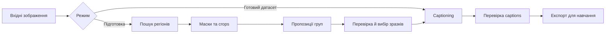

# План розвитку DatasetTools і captioning_tool

Дата: 2026-09-07. Статус: реалізацію розпочато; виправлено default prompts та виконано перший Mac Compact captioning smoke. Деталі й межі перевірки — у [MAC_TESTING.md](MAC_TESTING.md). Решта пунктів лишаються планом, якщо явно не зазначено інше.

Уточнення користувача: цільове обладнання — RTX від 8 GB VRAM, із можливістю підняти мінімум до 12 GB після перевірки. Стиль даних невідомий; потрібна робота з фото, ілюстраціями та змішаними наборами. Вимогу спільного venv знято.

Мета — локальний інструмент, у якому користувач вибирає папку та мету навчання, готує навчальні зразки, перевіряє групи, створює captions та експортує результат. Уже підготовлений датасет має проходити прямо до captioning. Основний експорт містить зображення, captions, необов’язкові маски та рекомендації з навчання й не залежить від OneTrainer. Інтеграції з конкретними інструментами додають конфігурації та зручний запуск і не є умовою використання датасету, зокрема на іншому ПК.

## 1. Від чого відштовхуємося

За переглянутим кодом уже реалізовано:

- Рекурсивний імпорт, захист від колізій назв, копіювання оригіналів і контроль SHA-256.
- JoyCaption для описів, Qwen3-VL-8B для bounding boxes, SAM 2.1 Large для масок. Моделі завантажуються послідовно, з очищенням GPU між стадіями.
- Режими `captions`, `regions`, `all`; промпти з файлів; локальні моделі із зафіксованими revisions.
- JSON-метадані, previews, HTML-звіт та експорт image/TXT пар і конфігурацій OneTrainer.
- Windows embedded Python bootstrap: скрипт первинного встановлення розпаковує локальний Python runtime та встановлює залежності. Це опис наявного коду, а не вимога використовувати embedded Python у майбутніх версіях.

Додано вибір Compact/Quality і device/dtype та базовий dataset-only експорт. Ще відсутні GUI, довільний вибір моделей, crops, групування, resume, персоналізовані поради та експорт навчальних масок. `--resolution` задає конфігурацію навчання, але не готує зображення. `characters` і `person_N` обмежують поточний формат персонажами. `masked_training` явно вимкнений.

Перші виправлення перед розширенням:

1. Виконано: стандартні шляхи промптів у CLI виправлено на `prompts/neutral/*.txt`; додано регресійний тест.
2. `--check` зараз не є повною перевіркою GPU, RAM, диска та сумісності пакетів. Відокремити перевірку встановлення від перевірки конкретного завдання.
3. Закріпити версію/commit OneTrainer, для якої підтримується експорт, та перевіряти його через відповідний loader. Поточні заяви README про попередні GPU-перевірки не є новим тестуванням у межах цього плану.

## 2. Спільне середовище та переносність

Рішення після уточнення користувача: окремий Python environment для кожного інструмента, зі спільним керуванням запуском, моделями та кешами. Спільний venv не є вимогою; не витрачати час на примусове узгодження залежностей ComfyUI, OneTrainer і captioning.

Обов’язкова вимога — автоматично кероване ізольоване середовище без ручного налаштування Python користувачем. На етапі базового runtime порівняти поточний embedded bundle зі звичайним Python та окремим venv, який launcher створює автоматично. Вибір зафіксувати після перевірки встановлення залежностей, пакування GUI, оновлення й відновлення на цільовій Windows-машині. Embedded не є наперед затвердженим переможцем; звичайний venv після перенесення відтворюється.

Спільне керування запуском означає необов’язковий launcher: він запускає встановлений сторонній інструмент у його власному середовищі, передає шлях до датасету чи підтримуваної конфігурації та використовує налаштовані корені даних. OneTrainer, ComfyUI та інші інструменти не потрібно встановлювати для підготовки й базового експорту датасету. Спільні шляхи не означають автоматичної сумісності моделей, масок або training configs.

Для першої поставки достатньо одного відтворюваного Windows/NVIDIA runtime для captioning та переносного формату проєкту. Спільне керування кешами кількох інструментів і повний offline-інсталятор додавати на етапі інтеграцій. Наведені нижче вимоги описують цільову переносність; вони не всі є умовою випуску першого GUI. Роботу з уже підготовленим локальним кешем перевіряти окремо від встановлення без мережі на чистому ПК.

Причина: сторонні пакети можуть вимагати різних Python/PyTorch/Transformers та native extensions. Встановлення custom node не повинно ламати captioning або тренування. ComfyUI також рекомендує ізоляцію залежностей у [manual installation](https://docs.comfy.org/installation/manual_install). Спільний venv для всіх можливий лише для конкретного перевіреного набору версій; він не має бути обов'язковою архітектурною вимогою.

Звичайний venv містить прив'язки до шляхів і загалом не переноситься простим копіюванням: це прямо описано в [документації Python](https://docs.python.org/3/library/venv.html). Portable означатиме:

- Код, датасети, проєкти, моделі й налаштування можна перемістити; launcher визначає корінь від власного розташування.
- Середовище відтворюється під цільову ОС/архітектуру/GPU за зафіксованим набором залежностей. Для Windows можна окремо підтримувати протестований переносний runtime bundle.
- Для offline-встановлення готується пакет із потрібними wheels, runtime і моделями саме для цільової платформи. Windows runtime не переноситься на Linux/macOS.
- GPU-драйвер — вимога до ПК. CUDA-профіль вибирається за сумісністю обладнання й пакетів; не фіксувати один CUDA-профіль для всіх майбутніх ПК.
- Внутрішні шляхи проєкту — відносні. Зовнішні джерела й моделі мають root mappings, які можна перевибрати після переміщення. Абсолютні шляхи OneTrainer формуються під час експорту/запуску.
- Спільний model cache з ключем repository + revision; адаптери використовують його там, де формат сумісний. Спільний кеш завантажень пакетів економить трафік, але не гарантує одну фізичну копію бібліотек у різних environments.
- Замість одного `ready.txt` — перевірка версії runtime і fingerprint встановлених залежностей; перевірка контрольних сум bootstrap-артефактів, відновлення перерваного встановлення.

Орієнтовне розміщення, вводити поступово:

```text
DatasetTools/
  captioning_tool/      # поточний інструмент та його GUI
  runtime/             # середовища й маніфести встановлення, поза Git
  models/              # спільні ваги/процесори, поза Git
  cache/               # завантаження, thumbnails, embeddings, поза Git
  projects/            # переносні проєкти обробки, поза Git
  integrations/        # запуск/експорт для сторонніх тулів, коли вони додані
```

Основний цільовий профіль — Windows x64 + NVIDIA, відповідно до наявного bootstrap. Додати ранній експериментальний профіль Mac Compact для поточного MacBook Pro: M1 Pro, 16 GPU-ядер, 32 GB спільної пам’яті, macOS 26.6.2. Його підтримку підтверджувати окремо за стадіями; успіх на цьому Mac не означає перевірки всіх Apple Silicon або Intel Mac. Linux та AMD GPU лишаються окремими майбутніми профілями. CPU достатній для GUI, імпорту, перегляду й експорту; CPU inference треба окремо оцінити за швидкістю.

## 3. Моделі та конфігурації ПК

Користувач вибирає профіль `Auto`, `Compact`, `Balanced`, `Quality` або окремі моделі для captioning, пошуку регіонів і сегментації. Потужний ПК не блокує вибір Compact. Вибір моделі captioning незалежний від сімейства моделі, яку навчатимуть.

Початкові кандидати для порівняння, не гарантовані вимоги до VRAM:

| Профіль | Captions | Пошук регіонів | Маски |
| --- | --- | --- | --- |
| Compact | Qwen3-VL-2B | Qwen3-VL-2B | SAM 2.1 Tiny |
| Balanced | Qwen3-VL-4B | Qwen3-VL-4B | SAM 2.1 Tiny; більший варіант за результатами тестів |
| Quality | Поточний JoyCaption або Qwen3-VL-8B за результатами порівняння | Qwen3-VL-8B | Поточний SAM 2.1 Large |

Є офіційні [Qwen3-VL-2B](https://huggingface.co/Qwen/Qwen3-VL-2B-Instruct), [4B](https://huggingface.co/Qwen/Qwen3-VL-4B-Instruct) та [SAM 2.1 Tiny](https://huggingface.co/facebook/sam2.1-hiera-tiny). Це дає реальні кандидати для легших режимів. Qwen для captions — альтернативна модель, а не компактна версія JoyCaption; якість і стиль потрібно порівняти на наших даних. Поточний [JoyCaption](https://huggingface.co/fancyfeast/llama-joycaption-beta-one-hf-llava) лишається baseline.

Порядок вибору Auto:

1. Визначити GPU/backend, вільну VRAM, RAM, підтримувані dtype та місце на диску.
2. Запропонувати профіль із запасом пам'яті; показати розмір завантаження й доступні локально моделі.
3. Виконати короткий пробний запуск; виміряти peak VRAM і час. Не робити висновок про весь датасет лише з одного маленького зображення.
4. Вказати обмеження input pixels, tokens і batch. Завантажувати тільки потрібні моделі, по одній GPU-стадії одночасно.
5. При OOM зберегти прогрес. Спочатку зменшити batch/ліміт input pixels у дозволених користувачем межах; меншу модель застосовувати за явно вибраною політикою fallback. Фактичні модель і параметри записувати для кожного результату.

Перший Compact реалізувати через меншу модель. 8/4-bit quantization і CPU offload додавати після перевірки backend, платформи, пам'яті та якості; це не універсальна заміна BF16. Заміна моделі не змінює вже затверджені captions без окремого rerun.

Compact цілиться в RTX 8 GB VRAM. Якщо на репрезентативних даних не вдається отримати прийнятні якість і швидкість, опублікувати мінімум 12 GB з виміряним поясненням. Насамперед перевірити Qwen3-VL-2B + SAM 2.1 Tiny послідовно, з обмеженнями input pixels/tokens; це реалістичний кандидат для експерименту, але не підтверджена гарантія пам'яті. Доступність captioning на 8 GB не означає можливість навчання будь-якої цільової моделі на тому самому ПК.

Мінімальні вимоги публікувати після замірів. Планова матриця тестування: 8, 12–16, 24–32 GB VRAM, із фіксацією конкретної RTX, RAM, resolution, часу та OOM. Це діапазони для тестування, а не обіцянка запуску на кожній карті.

Перевірка Compact на 8 GB — ранній окремий експеримент до реалізації Auto та повного вибору моделей. На контрольній вибірці перевірити captioning, пошук регіонів і послідовний запуск SAM. Після baseline зафіксувати числові пороги якості, часу й пам’яті та оцінити кандидата за ними. Пороги мають бути визначені до рішення про підтримку 8 GB або підняття мінімуму до 12 GB; сам факт відсутності OOM не означає прийнятної якості.

### 3.1. Ранній експеримент Mac Compact

Мета — отримати локальний captioning на поточному M1 Pro, а після його перевірки оцінити регіони й маски. Експеримент проводиться поруч із перевіркою RTX 8 GB, не замінює її та не включає навчання моделей на Mac. 32 GB спільної пам’яті використовують система, CPU та GPU; це не еквівалент 32 GB виділеної VRAM.

Стан після першого експерименту: окреме Python 3.13 arm64 середовище й Mac launcher створено, Qwen3-VL-2B на MPS float16 успішно обробила 12 фото Beans. Default prompts виправлено, device path спільний. Регіони, SAM, різноманітна вибірка та повні заміри пам’яті ще потребують перевірки; див. MAC_TESTING.md.

Порядок робіт:

1. Створити окреме середовище з Python arm64 та сумісними зафіксованими PyTorch/Transformers. Версію Python вибрати за доступністю потрібних пакетів, без обов’язкової прив’язки до системного Python. Додати запуск без BAT/PowerShell, перевірку MPS і локальних моделей.
2. Прибрати жорстку CUDA-прив’язку: явний вибір `cuda / mps / cpu`, перевірені dtype, розміщення моделей і tensors та очищення пам’яті відповідного backend. Використовувати спільні функції pipeline без окремої ієрархії backend-класів. CPU fallback для несумісних операцій дозволяти лише явно й записувати в результатах і замірах.
3. Перший запуск — captions через Qwen3-VL-2B, batch=1, з обмеженнями input pixels і output tokens. Почати з PyTorch MPS для повторного використання коду; BF16 не переносити з CUDA без перевірки. Інший backend розглядати за конкретної проблеми сумісності або неприйнятної швидкості.
4. Виконати smoke на 10–20 фото й ілюстраціях різних розмірів, включно з великими кадрами та кількома об’єктами. Перевірити captions, image/TXT і незмінність джерел. Далі оцінити на спільній контрольній вибірці 100–200 зображень для порівняння з Windows Compact.
5. Після успіху captioning перевірити Qwen3-VL-2B для регіонів, потім SAM 2.1 Tiny. Запускати моделі послідовно, перевіряти координати після EXIF/resize та збіг масок із зображеннями. Фіксувати підтримку стадій окремо: Mac captioning може бути доступний до завершення перевірки сегментації.

Критерії готовності: відтворюваний запуск, коректні результати; записані версії, device/dtype, параметри входів, час завантаження й час на зображення, пікове використання пам’яті MPS і процесом, memory pressure/swap та всі OOM/fallback. Перевірити серію зображень на накопичення пам’яті й повторний запуск після помилки. Після baseline зафіксувати допустимі якість, час і пам’ять перед рішенням про доступність Mac Compact. Короткий smoke не підтверджує продуктивності на великому датасеті.

На етапі GUI окремо перевірити worker, чуйність інтерфейсу, Stop/Resume, діалоги папок і незалежний експорт на цьому Mac. Великі JoyCaption/Qwen/SAM профілі та навчання на Apple GPU не входять у перший експеримент.

## 4. Два основні режими

Перед підготовкою й captioning запропонувати вибір мети: стиль, персонаж, предмет/новий концепт, поза/взаємодія або власний опис. Уточнити, які властивості мають зберігатися, а які — змінюватися в генераціях. Дозволити «Ще не визначено» для звичайного captioning. Мета впливає на пропозиції crops, склад зразків і caption presets; вона не визначається автоматично лише за вмістом папки. Базова модель, метод навчання, trainer та обладнання для навчання можуть бути вибрані пізніше.

**Caption готового датасету:** вибрати папку → модель і стиль опису → captions → перегляд/редагування → експорт.

Імпорт готового датасету має розпізнавати наявні TXT поруч із зображеннями за спільним stem у тій самій папці, зберігаючи відповідність після перейменування при імпорті. Початковий текст зберігати незмінним окремо від згенерованої та відредагованої версій. Передбачити політики «Зберегти наявні», «Заповнити відсутні» та «Перегенерувати вибрані»; за замовчуванням зберігати наявні. Порожні TXT вважати відсутніми, неоднозначні відповідності й помилки читання показувати для перевірки. Імпортований caption не отримує автоматичного затвердження для експорту; дозволити пакетне затвердження після перегляду.

**Підготовка датасету:** вибрати невпорядковану папку → задати, що шукати, або Auto discovery → регіони й маски → варіанти crops → групи → перевірка → детальні captions кінцевих зразків → експорт.

Усі проміжні результати зберігаються. Можна закінчити після підготовки, продовжити пізніше або змінити тільки промпт captioning без повторної сегментації.



## 5. Пошук і групування концептів

Треба розділити кілька різних задач:

| Що шукаємо | Що означає група |
| --- | --- |
| Обличчя, руки, мечі, автомобілі | Категорія об'єкта або частини тіла |
| Той самий персонаж/предмет на різних кадрах | Візуальна ідентичність, потребує окремої перевірки |
| Сидить, біжить, рука тримає предмет | Поза, дія або взаємодія |
| Манера малювання/освітлення | Атрибут кадру чи стилю, не обов'язково окремий регіон |

Один зразок може мати кілька атрибутів. Не змішувати identity, позу та категорію в одну взаємовиключну кластеризацію. Локальний `person_1` на двох зображеннях не означає того самого персонажа.

Перший варіант використовує поточний Qwen для регіонів і SAM для масок. Формат стає загальним: `regions` з `region_id`, `label`, `description`, `bbox`, `mask`, необов'язковим `parent_region_id` для руки/обличчя персонажа. Координати явно мають систему відліку, нормалізацію та трансформацію до оригіналу після EXIF.

Керований пошук приймає звичайний промпт і presets: «обличчя», «руки», «окремі предмети», «персонажі», «людина разом із предметом, який тримає». Для пошуку за короткими назвами об'єктів порівняти [Grounding DINO](https://github.com/IDEA-Research/GroundingDINO) з Qwen; не додавати ще один backend без вимірюваної користі. SAM уточнює заданий регіон, але сам по собі не вирішує семантичне групування.

Auto discovery: загальний огляд → список видимих категорій → локалізація → маски → пропозиції груп. Це пошук кандидатів, який може щось пропустити. Для великих кадрів передбачити огляд плюс перекривні tiles за потреби, перенесення координат і видалення дубльованих detections. Поточне зменшення до 1024 може приховувати дрібні руки чи предмети.

Групування розвивати поступово:

1. Групи за категоріями, ручне перейменування, merge/split, перенесення зразків.
2. Embeddings кінцевих crops і пропозиції груп за схожістю; [DINOv2](https://github.com/facebookresearch/dinov2) — кандидат для baseline, не гарантія identity. Окремий embedding checkpoint додається в модельний профіль та облік пам'яті.
3. Подібні зразки рекомендуються користувачеві; невпевнені залишаються `unassigned`. Не задавати наперед кількість невідомих персонажів і не змушувати кожний crop потрапити у кластер.
4. Для великих наборів використовувати пошук найближчих сусідів замість повної матриці всіх пар. Виміряти потребу перед додаванням спеціалізованого індексу.

Фото й стилізовані ілюстрації оцінювати окремо та разом у змішаній папці: користувач не знає стиль наперед, тому ручний вибір стилю не має бути обов'язковим для запуску. Схожий одяг або фон можуть хибно зближувати різних персонажів, а зміна ракурсу — розділяти одного. Групи мають бути редагованими; обіцянки повністю автоматичної правильної ідентифікації немає.

## 6. Crops, aspect ratio та маленькі об'єкти

Для кожного регіону запропонувати tight crop, crop із контекстом або цілий кадр із маскою. Вибір залежить від цілі: обличчя потребує одних меж, рука з предметом або поза всього тіла — інших.

- Зберігати оригінали незмінними. Кожний crop — похідний зразок з посиланням на джерело, координатами та параметрами перетворення.
- Розширювати bbox під потрібний контекст і допустиме співвідношення сторін, не зрізаючи ціль. Поза кадром не вигадувати пікселі.
- Не розтягувати зображення до квадрата. Зберігати якісний crop у його вихідній роздільності; training/export profile визначає aspect buckets та необхідний resize.
- Конкретні buckets, кратність розмірів та політику наступного crop у trainer перевіряти для обраної архітектури й версії тренувального інструмента. Не застосовувати універсальні «1024×1024 для всіх».
- Image і mask повинні проходити однакові EXIF/crop/resize/flip перетворення. Для бінарної маски використовувати nearest-neighbor, після перетворення перевіряти розміри та непорожню область.
- Показувати source pixels об'єкта, масштаб збільшення, його розмір після training resize, blur, перекриття, обрізані краї та площу маски. Пороги прийнятності залежать від типу концепту й уточнюються тестами.
- Малі, але деталізовані регіони можуть працювати як crop. Дуже маленькі чи розмиті — у чергу перевірки або виключення. Автоматичний generative upscale не вмикати: він може додати неіснуючі деталі концепту.

Приклад: обличчя 40×40 у кадрі 4000×3000 при зменшенні цілого кадру до 1024×768 стане приблизно 10×10. Маска не відновить інформацію. Crop 40×40 з upscale також не стане справжнім деталізованим обличчям. Контекст може зробити зразок корисним для іншої цілі, але не гарантує придатності для навчання дрібних рис.

Детальний caption генерується за кінцевим crop/кадром. Опис повного джерела не можна автоматично прикріплювати до вирізаної руки. Для кадру з маскою caption описує видиму сцену й однозначно вказує цільовий концепт; маска не передає його значення текстовому encoder.

Кілька crops одного джерела не є незалежними прикладами. Ввести обмеження надмірної кількості схожих crops, перевірку дублікатів і групування за джерелом при train/validation split.

## 7. Незалежний експорт і рекомендації з навчання

### 7.1. Основний результат

Базовий експорт працює без вибору та встановлення trainer. Він містить папку `data/` із затвердженими image/TXT парами, необов’язкову папку `masks/`, `dataset_manifest.json` із відносними шляхами, IDs, хешами та відповідністю зразків джерелам, і текстовий файл `TRAINING_ADVICE.txt` у UTF-8. Базові маски — PNG у розмірах відповідних зображень, біле позначає цільову область; їхній зміст і формат описані в manifest. Наявність масок у пакеті не означає, що довільний trainer використає їх автоматично.

Конфігурації конкретного trainer — необов’язковий додатковий експорт. OneTrainer лишається першим підтримуваним варіантом завдяки наявному коду, але не задає основний формат датасету. Назви й розташування масок, схеми captions, preprocessing і training configs перетворюються та перевіряються для конкретного trainer/версії/архітектури. Невідома комбінація не блокує базовий експорт і поради щодо даних; готову training-конфігурацію для неї не генерувати.

### 7.2. Мета та персоналізовані поради

`TRAINING_ADVICE.txt` формується за фактично експортованими затвердженими зразками та явно вказаною метою. Пропонується обґрунтований стартовий рецепт із планом перевірки, а не обіцянка оптимальних параметрів без пробного навчання.

| Мета | Що оцінювати й враховувати в підготовці |
| --- | --- |
| Стиль | Різноманіття сюжетів; чи стиль не представлений лише одним персонажем або фоном |
| Персонаж | Ракурси, плани, одяг і фони; які риси ідентичності мають залишатися сталими |
| Предмет / новий концепт | Характерні деталі, масштаби, контексти використання та видимість цілі |
| Поза / взаємодія | Видимість потрібних частин тіла й предметів; достатній контекст crop для дії |

Файл містить:

- Мету, властивості для збереження/варіації, базову модель, метод навчання (наприклад LoRA або повне донавчання), trainer/версію та відоме обладнання для навчання. GPU підготовки датасету не вважати автоматично GPU навчання.
- Статистику експортованих зразків: кількість незалежних джерел і crops, розміри, дублікати, баланс груп та доступні оцінки captions, різноманіття й якості. Автоматичні семантичні оцінки позначати як припущення, які потребують перегляду; невиміряні показники не вигадувати.
- Пропозиції виправлення даних і captions, а потім доречні параметри: resolution/buckets, batch/accumulation, діапазон optimizer steps, learning rate, scheduler, LoRA rank/alpha та інші налаштування, лише якщо вони застосовні до вибраного методу й перевіреного рецепта.
- Пояснення кожної рекомендації, припущення, обмеження та походження рецепта: його версію, джерело й статус перевірки. Окремо позначати перевірені presets та евристичні корекції.
- План короткого пробного навчання: контрольні промпти, фіксовані умови порівняння, checkpoints, ознаки недонавчання/перенавчання й порядок зміни параметрів. Перевіряти як відтворення цілі, так і варіативність поза навчальними прикладами; за наявності validation split не розділяти crops одного джерела між train і validation.

Коли модель, метод або trainer невідомі, дати поради щодо даних та перелік відсутнього контексту. Точні залежні від них параметри залишити невизначеними. Поточна формула кроків лише за кількістю зображень — запасна явно позначена евристика, а не персоналізація. Повтори, кілька crops одного джерела та фактичний effective batch враховуються в оцінці кількості показів і кроків.

Перша реалізація — невелика таблиця рецептів та прозорі функції правил у наявному модулі експорту; окремий сервіс чи ієрархія класів не потрібні. Почати з однієї перевіреної комбінації моделі, методу й trainer. Розширювати числові рекомендації після перевірок; поради щодо підготовки для всіх перелічених цілей доступні відразу. Текст рекомендацій і необов’язкова training-конфігурація використовують ті самі розраховані значення.

### 7.3. Перший варіант masked export: OneTrainer

За [документацією OneTrainer](https://github.com/Nerogar/OneTrainer/wiki/Training#masked-training), біла область маски визначає цільову область, а PNG-маски використовують суфікс `-masklabel.png`. Для `sample.jpg` очікується `sample-masklabel.png`; конвенцію підтвердити інтеграційним тестом pinned loader.

Передбачити два явні варіанти: звичайні image/TXT пари та image/TXT/mask пари з увімкненим masked training. Параметри `unmasked_probability`, `unmasked_weight` та нормалізація loss повинні бути частиною перевіреного пресету, видимими в розширених налаштуваннях. Для строгого фокусу перевірити варіант із нульовими probability/weight, а не мовчки залишати defaults.

Це просторове зважування навчальної помилки, а не гарантія ізоляції attention чи повного виключення впливу фону. Маска має збігатися з експортованим зображенням. Порожня/відсутня/несумісна маска в masked-режимі не повинна мовчки перетворювати зразок на звичайне навчання.

Для кількох цілей в одному джерелі експортувати окремі sample IDs з відповідними caption і маскою. Перед експортом виключати незатверджені зразки. Сумісність звичайного експорту й masked training перевіряти окремо для кожної підтримуваної архітектури; не генерувати «готовий» конфіг для неперевіреної комбінації.

## 8. GUI

Рекомендація для першої версії — PySide6/Qt Widgets: Python GUI з нативним [вибором файлів і папок](https://doc.qt.io/qtforpython-6/PySide6/QtWidgets/QFileDialog.html), придатний для локальної роботи з великими наборами зображень. Це додає Qt до runtime, але не потребує окремої браузерної файлової навігації. До фіксації залежностей перевірити пакування на цільовій Windows-машині.

Один застосунок із режимами «Captioning» і «Підготовка», спільними налаштуваннями моделей та експортом:

- Вибір input/output через діалоги, drag-and-drop папки, недавні проєкти.
- Мета навчання та власний опис очікуваного результату до підготовки/captioning; необов’язкові модель, метод, trainer та обладнання для навчання. Перегляд `TRAINING_ADVICE.txt` перед експортом, із видимими припущеннями й невизначеними параметрами.
- Профіль ПК і окремий ручний вибір моделей; показ вільної VRAM, обсягу завантажень і результату preflight.
- Presets пошуку й редактор промпту всередині GUI; імпорт/експорт TXT лишається доступним.
- Пробний запуск на вибраних зображеннях перед усією папкою.
- Галерея з thumbnails, фільтри груп/помилок/неперевірених, перегляд оригіналу, crop і mask overlay.
- Корекція bbox, прийняття/відхилення crops, merge/split груп, редагування captions; пензель для масок — наступне доповнення після базового перегляду.
- Прогрес за стадіями, лічильники, зрозумілі помилки, Stop після поточної операції та Resume. Скасування не означає миттєве переривання GPU kernel.
- Експорт звичайного або masked dataset з попереднім підсумком: скільки прийнято, виключено і чому.

Inference працює в окремому worker process, тому GUI лишається чуйним, а аварія GPU не закриває проєкт. Worker і CLI використовують ті самі функції pipeline; достатньо структурованих подій через stdout і простого керування процесом. Не потрібні сервер, plugin framework чи універсальна черга розподілених задач.

## 9. Мінімальні зміни в коді та форматі даних

Зберегти CLI та наявні `engine.py`, `training_export.py`. Виділяти нові модулі за появою конкретної функції: підготовка/crops, групування, GUI. Таблиця моделей і профілів достатня як конфігурація; DI container та ієрархія класів backend на цьому етапі не потрібні. Qt-класи вводити лише для фактичних екранів/моделей списків.

Проєкт має versioned manifest і записи зразків: стабільні `source_id`, SHA-256, `region_id`, `sample_id`, відносні шляхи image/mask, crop transform, модель/revision/параметри, групи/атрибути, QA flags, статус перевірки, початковий імпортований caption, raw caption та його редагована версія. IDs зберігаються в manifest і не перераховуються при відновленні або додаванні файлів з однаковими назвами.

На рівні проєкту зберігати мету, побажання щодо сталих і змінних властивостей, відомий контекст навчання та версію правил рекомендацій. Поради прив’язані до snapshot експорту: його складу й версій зразків, мети та контексту навчання. Зміна цих входів робить попередні поради застарілими для нового експорту. Зміна мети не перезаписує crops або captions автоматично: показати залежні пропозиції для повторного перегляду; новий текст або crop проходить звичайне повторне затвердження.

Resume працює за стадією й відбитком її входів: зміна crop інвалідує його embedding і caption, зміна caption prompt — лише caption, перейменування групи — лише залежний експорт/текст, якщо назва входить у нього. Ручні правки не перезаписуються автоматично. Записувати результати атомарно; незавершена операція не отримує статус `complete`.

Затвердження прив’язане до конкретної версії image/crop, caption і маски, якщо вона використовується. Зміна crop скидає затвердження: старий ручний caption зберігається як попередня версія, а зразок переходить у стан «Потребує повторної перевірки». Новий результат генерації або зміна маски для masked export також потребують повторного затвердження. Застарілий опис не може автоматично потрапити в експорт із новим зображенням; статус виконання стадії та статус перевірки користувачем — окремі поля.

Формат проєкту й resume реалізувати та перевірити через CLI до GUI. Поточний CLI відхиляє непорожній output, а exporter створює каталог лише один раз: для відновлення потрібен явний режим відкриття валідного проєкту, а не загальне зняття захисту від перезапису. Повторний експорт створює новий snapshot затверджених версій у тимчасовому каталозі й позначає його готовим лише після перевірки всіх файлів; попередній завершений експорт зберігається. Після аварії незавершений snapshot не використовується для навчання. Перевірити аварії під час запису метаданих, між стадіями та посеред експорту, а також повторний запуск без змін.

На старті достатньо JSON-метаданих на зразок і компактного індексу. Галерея читає сторінками, кешує thumbnails і не тримає всі повнорозмірні картинки/маски в RAM. SQLite додавати лише за підтвердженої потреби в обсягах або запитах.

## 10. Послідовність реалізації та критерії готовності

| Етап | Результат | Перевірка завершення |
| --- | --- | --- |
| 0. Базова працездатність | Виправлені default prompts, узгоджений README, точний preflight | Чистий запуск із defaults; наявні тести; smoke без завантаження моделей |
| 1. Експеримент Compact і базовий runtime | Вибір embedded bundle або автоматично створюваного venv; один відтворюваний Windows/NVIDIA runtime; заміри Compact на 8 GB проти baseline | Captioning, регіони й SAM на контрольній вибірці; зафіксовані пороги якості/часу/пам’яті та рішення щодо 8 або 12 GB; встановлення, перевірка пакування GUI й відновлення runtime на чистому ПК |
| 1M. Mac Compact, поруч з етапом 1 | Окреме arm64 середовище, device/dtype, Qwen3-VL-2B captioning через MPS; потім регіони й SAM Tiny | Smoke 10–20 зображень, далі спільна контрольна вибірка; заміри часу/пам’яті та якості; повторний запуск; окремий статус підтримки кожної стадії |
| 2. Формат проєкту та resume через CLI | Versioned manifest, стабільні IDs, імпорт TXT, атомарні записи, повторний експорт | Відновлення після аварій під час запису, між стадіями й посеред експорту; відсутність дублікатів; збереження початкових TXT і ручних правок; відкриття після перенесення проєкту |
| 3. GUI captioning та незалежний експорт | Мета навчання, папки, presets, прогрес, перегляд/правки, Stop/Resume; image/TXT + manifest + TRAINING_ADVICE.txt; перший рецепт рекомендацій | Експорт без встановленого trainer; поради відповідають лише експортованим зразкам і змінюються з метою; невідомий контекст не породжує точних параметрів; числа порад і підтримуваного config узгоджені; усі три політики TXT працюють; аварія worker не закриває GUI; inference з кешем без мережі |
| 4. Керована підготовка | Загальні regions, текстовий запит, masks/crops, ручні групи | Обличчя, руки й предмети на контрольному наборі; правильні координати після EXIF/resize; зміна crop скидає затвердження й блокує експорт старого caption; оригінали незмінні |
| 5. Маски в базовому експорті та перша training-інтеграція з ними | Image/TXT/mask + manifest; додатковий masked preset для однієї обраної архітектури та pinned OneTrainer | Базовий пакет масок доступний без trainer; реальний loader інтеграції бачить маски; overlay після preprocessing правильний; короткий навчальний smoke; відсутні/порожні маски блокують masked export |
| 6. Автоматизація та групування | Auto профіль за замірами, Auto discovery, embeddings, unassigned, merge/split | Перевірені вибір профілю та OOM fallback; виміряні пропуски регіонів, помилкові об'єднання, частка ручних правок і витрати на великій папці |
| 7. Інтеграції та спільна інфраструктура | Launcher ComfyUI/OneTrainer, спільні кеші й корені, повний offline-пакет для цільової платформи | Встановлення/оновлення одного інструмента не порушує роботу іншого; перенесення спільних коренів; встановлення offline-пакета на чистому ПК без мережі |

Перша корисна поставка — етапи 0–3, включно з незалежним експортом і базовими персоналізованими порадами. Перша повна підготовка з масками — етапи 4–5: базовий датасет і одна перевірена інтеграція masked training. Інші trainer/архітектури та числові рецепти додаються після окремих loader/preprocessing/training smoke перевірок. Автоматичне знаходження невідомих концептів і впізнавання персонажів виділене окремо через невизначеність якості; спільна інфраструктура кількох інструментів не блокує першу поставку.

Для раннього порівняння моделей підготувати репрезентативну вибірку приблизно 100–200 зображень: різні розміри й аспекти, дрібні об'єкти, кілька персонажів, перекриття, дублікати, фото/ілюстрації за фактичним використанням. На етапі 1 оцінювати точність регіонів, помилки captions, маски, час на зображення та peak VRAM; у наступних етапах доповнити оцінками придатності crops і якості груп на тій самій вибірці. Числові пороги приймання встановити після baseline та до рішення про мінімальне обладнання; SAM score не підміняє оцінку якості датасету.

Mac Compact проходить ранній етап 1M поруч з етапом 1. Його результати використовуються в етапах 2–3 для перевірки CLI та GUI на поточному Mac. Статус готовності Mac і Windows вести окремо; невдача Mac-сегментації не блокує перевірений Mac-captioning або Windows-поставку.

## 11. Що уточнити перед реалізацією

- Системна RAM і конкретні Windows/NVIDIA машини для перевірки RTX 8 GB та резервного мінімуму 12 GB. Mac-експеримент уже погоджений: поточний M1 Pro, 16 GPU-ядер, 32 GB спільної пам’яті; ширшу матрицю Mac визначати після його результатів.
- Орієнтовна кількість зображень у папці. Вимога універсальності стилю вже визначена: фото, ілюстрації та змішані набори.
- Пріоритет групування: категорії, той самий персонаж/предмет чи пози/взаємодії.
- Перша комбінація базової моделі, методу та trainer для числового рецепта і end-to-end перевірки masked export. OneTrainer — початковий кандидат завдяки наявному коду; базовий експорт від нього не залежить.
- Контрольні приклади цілей «стиль», «персонаж», «концепт» і «поза/взаємодія» для перевірки рекомендацій. Конкретну мету кінцевий користувач задає в проєкті, вона не фіксується одна для всього застосунку.

Ці відповіді змінюють пріоритети й тестову матрицю, але не блокують базові виправлення, переносний формат проєкту та GUI captioning.
