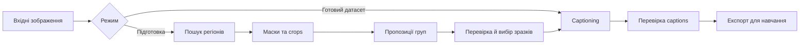

# План розвитку DatasetTools і captioning_tool

Дата: 2026-09-07. Статус: пропозиція для обговорення, без реалізації змін у pipeline.

Уточнення користувача: цільове обладнання — RTX від 8 GB VRAM, із можливістю підняти мінімум до 12 GB після перевірки. Стиль даних невідомий; потрібна робота з фото, ілюстраціями та змішаними наборами. Вимогу спільного venv знято.

Мета — локальний інструмент, у якому користувач вибирає папку, готує навчальні зразки, перевіряє групи, створює captions та експортує результат. Уже підготовлений датасет має проходити прямо до captioning. ComfyUI та OneTrainer надалі підключаються через спільні правила запуску і зберігання даних.

## 1. Від чого відштовхуємося

За переглянутим кодом уже реалізовано:

- Рекурсивний імпорт, захист від колізій назв, копіювання оригіналів і контроль SHA-256.
- JoyCaption для описів, Qwen3-VL-8B для bounding boxes, SAM 2.1 Large для масок. Моделі завантажуються послідовно, з очищенням GPU між стадіями.
- Режими `captions`, `regions`, `all`; промпти з файлів; локальні моделі із зафіксованими revisions.
- JSON-метадані, previews, HTML-звіт та експорт image/TXT пар і конфігурацій OneTrainer.
- Windows embedded Python bootstrap. Це локальний Python runtime, а не звичайний venv.

Ще відсутні GUI, вибір моделей, crops, групування, resume та експорт навчальних масок. `--resolution` задає конфігурацію навчання, але не готує зображення. `characters` і `person_N` обмежують поточний формат персонажами. `masked_training` явно вимкнений.

Перші виправлення перед розширенням:

1. Стандартні шляхи промптів у CLI вказують на `prompts/*.txt`, тоді як файли лежать у `prompts/neutral/*.txt`. Звичайний запуск без перевизначення шляхів зупиниться до inference.
2. `--check` зараз не є повною перевіркою GPU, RAM, диска та сумісності пакетів. Відокремити перевірку встановлення від перевірки конкретного завдання.
3. Закріпити версію/commit OneTrainer, для якої підтримується експорт, та перевіряти його через відповідний loader. Поточні заяви README про попередні GPU-перевірки не є новим тестуванням у межах цього плану.

## 2. Спільне середовище та переносність

Рішення після уточнення користувача: окремий Python environment для кожного інструмента, зі спільним керуванням запуском, моделями та кешами. Спільний venv не є вимогою; не витрачати час на примусове узгодження залежностей ComfyUI, OneTrainer і captioning.

Причина: сторонні пакети можуть вимагати різних Python/PyTorch/Transformers та native extensions. Встановлення custom node не повинно ламати captioning або тренування. ComfyUI також рекомендує ізоляцію залежностей у [manual installation](https://docs.comfy.org/installation/manual_install). Спільний venv для всіх можливий лише для конкретного перевіреного набору версій; він не має бути обов'язковою архітектурною вимогою.

Звичайний venv містить прив'язки до шляхів і загалом не переноситься простим копіюванням: це прямо описано в [документації Python](https://docs.python.org/3/library/venv.html). Portable означатиме:

- Код, датасети, проєкти, моделі й налаштування можна перемістити; launcher визначає корінь від власного розташування.
- Середовище відтворюється під цільову ОС/архітектуру/GPU за зафіксованим набором залежностей. Для Windows можна окремо підтримувати протестований переносний runtime bundle.
- Для offline-встановлення готується пакет із потрібними wheels, runtime і моделями саме для цільової платформи. Windows runtime не переноситься на Linux/macOS.
- GPU-драйвер — вимога до ПК. CUDA-профіль вибирається за сумісністю обладнання й пакетів; не фіксувати один CUDA-профіль для всіх майбутніх ПК.
- Внутрішні шляхи проєкту — відносні. Зовнішні джерела й моделі мають root mappings, які можна перевибрати після переміщення. Абсолютні шляхи OneTrainer формуються під час експорту/запуску.
- Спільний model cache з ключем repository + revision; адаптери використовують його там, де формат сумісний. Спільний кеш завантажень пакетів економить трафік, але не гарантує одну фізичну копію бібліотек у різних environments.
- Замість одного `ready.txt` — перевірка версії runtime і fingerprint встановлених залежностей; перевірка контрольних сум bootstrap-артефактів, відновлення перерваного встановлення.

Орієнтовне розміщення, вводити поступово:

```text
DatasetTools/
  captioning_tool/      # поточний інструмент та його GUI
  runtime/             # середовища й маніфести встановлення, поза Git
  models/              # спільні ваги/процесори, поза Git
  cache/               # завантаження, thumbnails, embeddings, поза Git
  projects/            # переносні проєкти обробки, поза Git
  integrations/        # запуск/експорт для сторонніх тулів, коли вони додані
```

Початкове припущення: перша підтримувана платформа — Windows x64 + NVIDIA, відповідно до наявного bootstrap. Linux/macOS та AMD/Apple GPU — окремі перевірені профілі, не автоматична обіцянка сумісності. CPU достатній для GUI, імпорту, перегляду й експорту; CPU inference треба окремо оцінити за швидкістю.

## 3. Моделі та конфігурації ПК

Користувач вибирає профіль `Auto`, `Compact`, `Balanced`, `Quality` або окремі моделі для captioning, пошуку регіонів і сегментації. Потужний ПК не блокує вибір Compact. Вибір моделі captioning незалежний від сімейства моделі, яку навчатимуть.

Початкові кандидати для порівняння, не гарантовані вимоги до VRAM:

| Профіль | Captions | Пошук регіонів | Маски |
| --- | --- | --- | --- |
| Compact | Qwen3-VL-2B | Qwen3-VL-2B | SAM 2.1 Tiny |
| Balanced | Qwen3-VL-4B | Qwen3-VL-4B | SAM 2.1 Tiny; більший варіант за результатами тестів |
| Quality | Поточний JoyCaption або Qwen3-VL-8B за результатами порівняння | Qwen3-VL-8B | Поточний SAM 2.1 Large |

Є офіційні [Qwen3-VL-2B](https://huggingface.co/Qwen/Qwen3-VL-2B-Instruct), [4B](https://huggingface.co/Qwen/Qwen3-VL-4B-Instruct) та [SAM 2.1 Tiny](https://huggingface.co/facebook/sam2.1-hiera-tiny). Це дає реальні кандидати для легших режимів. Qwen для captions — альтернативна модель, а не компактна версія JoyCaption; якість і стиль потрібно порівняти на наших даних. Поточний [JoyCaption](https://huggingface.co/fancyfeast/llama-joycaption-beta-one-hf-llava) лишається baseline.

Порядок вибору Auto:

1. Визначити GPU/backend, вільну VRAM, RAM, підтримувані dtype та місце на диску.
2. Запропонувати профіль із запасом пам'яті; показати розмір завантаження й доступні локально моделі.
3. Виконати короткий пробний запуск; виміряти peak VRAM і час. Не робити висновок про весь датасет лише з одного маленького зображення.
4. Вказати обмеження input pixels, tokens і batch. Завантажувати тільки потрібні моделі, по одній GPU-стадії одночасно.
5. При OOM зберегти прогрес. Спочатку зменшити batch/ліміт input pixels у дозволених користувачем межах; меншу модель застосовувати за явно вибраною політикою fallback. Фактичні модель і параметри записувати для кожного результату.

Перший Compact реалізувати через меншу модель. 8/4-bit quantization і CPU offload додавати після перевірки backend, платформи, пам'яті та якості; це не універсальна заміна BF16. Заміна моделі не змінює вже затверджені captions без окремого rerun.

Compact цілиться в RTX 8 GB VRAM. Якщо на репрезентативних даних не вдається отримати прийнятні якість і швидкість, опублікувати мінімум 12 GB з виміряним поясненням. Насамперед перевірити Qwen3-VL-2B + SAM 2.1 Tiny послідовно, з обмеженнями input pixels/tokens; це реалістичний кандидат для експерименту, але не підтверджена гарантія пам'яті. Доступність captioning на 8 GB не означає можливість навчання будь-якої цільової моделі на тому самому ПК.

Мінімальні вимоги публікувати після замірів. Планова матриця тестування: 8, 12–16, 24–32 GB VRAM, із фіксацією конкретної RTX, RAM, resolution, часу та OOM. Це діапазони для тестування, а не обіцянка запуску на кожній карті.

## 4. Два основні режими

**Caption готового датасету:** вибрати папку → модель і стиль опису → captions → перегляд/редагування → експорт.

**Підготовка датасету:** вибрати невпорядковану папку → задати, що шукати, або Auto discovery → регіони й маски → варіанти crops → групи → перевірка → детальні captions кінцевих зразків → експорт.

Усі проміжні результати зберігаються. Можна закінчити після підготовки, продовжити пізніше або змінити тільки промпт captioning без повторної сегментації.



## 5. Пошук і групування концептів

Треба розділити кілька різних задач:

| Що шукаємо | Що означає група |
| --- | --- |
| Обличчя, руки, мечі, автомобілі | Категорія об'єкта або частини тіла |
| Той самий персонаж/предмет на різних кадрах | Візуальна ідентичність, потребує окремої перевірки |
| Сидить, біжить, рука тримає предмет | Поза, дія або взаємодія |
| Манера малювання/освітлення | Атрибут кадру чи стилю, не обов'язково окремий регіон |

Один зразок може мати кілька атрибутів. Не змішувати identity, позу та категорію в одну взаємовиключну кластеризацію. Локальний `person_1` на двох зображеннях не означає того самого персонажа.

Перший варіант використовує поточний Qwen для регіонів і SAM для масок. Формат стає загальним: `regions` з `region_id`, `label`, `description`, `bbox`, `mask`, необов'язковим `parent_region_id` для руки/обличчя персонажа. Координати явно мають систему відліку, нормалізацію та трансформацію до оригіналу після EXIF.

Керований пошук приймає звичайний промпт і presets: «обличчя», «руки», «окремі предмети», «персонажі», «людина разом із предметом, який тримає». Для пошуку за короткими назвами об'єктів порівняти [Grounding DINO](https://github.com/IDEA-Research/GroundingDINO) з Qwen; не додавати ще один backend без вимірюваної користі. SAM уточнює заданий регіон, але сам по собі не вирішує семантичне групування.

Auto discovery: загальний огляд → список видимих категорій → локалізація → маски → пропозиції груп. Це пошук кандидатів, який може щось пропустити. Для великих кадрів передбачити огляд плюс перекривні tiles за потреби, перенесення координат і видалення дубльованих detections. Поточне зменшення до 1024 може приховувати дрібні руки чи предмети.

Групування розвивати поступово:

1. Групи за категоріями, ручне перейменування, merge/split, перенесення зразків.
2. Embeddings кінцевих crops і пропозиції груп за схожістю; [DINOv2](https://github.com/facebookresearch/dinov2) — кандидат для baseline, не гарантія identity. Окремий embedding checkpoint додається в модельний профіль та облік пам'яті.
3. Подібні зразки рекомендуються користувачеві; невпевнені залишаються `unassigned`. Не задавати наперед кількість невідомих персонажів і не змушувати кожний crop потрапити у кластер.
4. Для великих наборів використовувати пошук найближчих сусідів замість повної матриці всіх пар. Виміряти потребу перед додаванням спеціалізованого індексу.

Фото й стилізовані ілюстрації оцінювати окремо та разом у змішаній папці: користувач не знає стиль наперед, тому ручний вибір стилю не має бути обов'язковим для запуску. Схожий одяг або фон можуть хибно зближувати різних персонажів, а зміна ракурсу — розділяти одного. Групи мають бути редагованими; обіцянки повністю автоматичної правильної ідентифікації немає.

## 6. Crops, aspect ratio та маленькі об'єкти

Для кожного регіону запропонувати tight crop, crop із контекстом або цілий кадр із маскою. Вибір залежить від цілі: обличчя потребує одних меж, рука з предметом або поза всього тіла — інших.

- Зберігати оригінали незмінними. Кожний crop — похідний зразок з посиланням на джерело, координатами та параметрами перетворення.
- Розширювати bbox під потрібний контекст і допустиме співвідношення сторін, не зрізаючи ціль. Поза кадром не вигадувати пікселі.
- Не розтягувати зображення до квадрата. Зберігати якісний crop у його вихідній роздільності; training/export profile визначає aspect buckets та необхідний resize.
- Конкретні buckets, кратність розмірів та політику наступного crop у trainer перевіряти для обраної архітектури й версії OneTrainer. Не застосовувати універсальні «1024×1024 для всіх».
- Image і mask повинні проходити однакові EXIF/crop/resize/flip перетворення. Для бінарної маски використовувати nearest-neighbor, після перетворення перевіряти розміри та непорожню область.
- Показувати source pixels об'єкта, масштаб збільшення, його розмір після training resize, blur, перекриття, обрізані краї та площу маски. Пороги прийнятності залежать від типу концепту й уточнюються тестами.
- Малі, але деталізовані регіони можуть працювати як crop. Дуже маленькі чи розмиті — у чергу перевірки або виключення. Автоматичний generative upscale не вмикати: він може додати неіснуючі деталі концепту.

Приклад: обличчя 40×40 у кадрі 4000×3000 при зменшенні цілого кадру до 1024×768 стане приблизно 10×10. Маска не відновить інформацію. Crop 40×40 з upscale також не стане справжнім деталізованим обличчям. Контекст може зробити зразок корисним для іншої цілі, але не гарантує придатності для навчання дрібних рис.

Детальний caption генерується за кінцевим crop/кадром. Опис повного джерела не можна автоматично прикріплювати до вирізаної руки. Для кадру з маскою caption описує видиму сцену й однозначно вказує цільовий концепт; маска не передає його значення текстовому encoder.

Кілька crops одного джерела не є незалежними прикладами. Ввести обмеження надмірної кількості схожих crops, перевірку дублікатів і групування за джерелом при train/validation split.

## 7. Експорт масок для OneTrainer

За [документацією OneTrainer](https://github.com/Nerogar/OneTrainer/wiki/Training#masked-training), біла область маски визначає цільову область, а PNG-маски використовують суфікс `-masklabel.png`. Для `sample.jpg` очікується `sample-masklabel.png`; конвенцію підтвердити інтеграційним тестом pinned loader.

Передбачити два явні варіанти: звичайні image/TXT пари та image/TXT/mask пари з увімкненим masked training. Параметри `unmasked_probability`, `unmasked_weight` та нормалізація loss повинні бути частиною перевіреного пресету, видимими в розширених налаштуваннях. Для строгого фокусу перевірити варіант із нульовими probability/weight, а не мовчки залишати defaults.

Це просторове зважування навчальної помилки, а не гарантія ізоляції attention чи повного виключення впливу фону. Маска має збігатися з експортованим зображенням. Порожня/відсутня/несумісна маска в masked-режимі не повинна мовчки перетворювати зразок на звичайне навчання.

Для кількох цілей в одному джерелі експортувати окремі sample IDs з відповідними caption і маскою. Перед експортом виключати незатверджені зразки. Сумісність звичайного експорту й masked training перевіряти окремо для кожної підтримуваної архітектури; не генерувати «готовий» конфіг для неперевіреної комбінації.

## 8. GUI

Рекомендація для першої версії — PySide6/Qt Widgets: Python GUI з нативним [вибором файлів і папок](https://doc.qt.io/qtforpython-6/PySide6/QtWidgets/QFileDialog.html), придатний для локальної роботи з великими наборами зображень. Це додає Qt до runtime, але не потребує окремої браузерної файлової навігації. До фіксації залежностей перевірити пакування на цільовій Windows-машині.

Один застосунок із режимами «Captioning» і «Підготовка», спільними налаштуваннями моделей та експортом:

- Вибір input/output через діалоги, drag-and-drop папки, недавні проєкти.
- Профіль ПК і окремий ручний вибір моделей; показ вільної VRAM, обсягу завантажень і результату preflight.
- Presets пошуку й редактор промпту всередині GUI; імпорт/експорт TXT лишається доступним.
- Пробний запуск на вибраних зображеннях перед усією папкою.
- Галерея з thumbnails, фільтри груп/помилок/неперевірених, перегляд оригіналу, crop і mask overlay.
- Корекція bbox, прийняття/відхилення crops, merge/split груп, редагування captions; пензель для масок — наступне доповнення після базового перегляду.
- Прогрес за стадіями, лічильники, зрозумілі помилки, Stop після поточної операції та Resume. Скасування не означає миттєве переривання GPU kernel.
- Експорт звичайного або masked dataset з попереднім підсумком: скільки прийнято, виключено і чому.

Inference працює в окремому worker process, тому GUI лишається чуйним, а аварія GPU не закриває проєкт. Worker і CLI використовують ті самі функції pipeline; достатньо структурованих подій через stdout і простого керування процесом. Не потрібні сервер, plugin framework чи універсальна черга розподілених задач.

## 9. Мінімальні зміни в коді та форматі даних

Зберегти CLI та наявні `engine.py`, `training_export.py`. Виділяти нові модулі за появою конкретної функції: підготовка/crops, групування, GUI. Таблиця моделей і профілів достатня як конфігурація; DI container та ієрархія класів backend на цьому етапі не потрібні. Qt-класи вводити лише для фактичних екранів/моделей списків.

Проєкт має versioned manifest і записи зразків: `source_id`, SHA-256, `region_id`, `sample_id`, відносні шляхи image/mask, crop transform, модель/revision/параметри, групи/атрибути, QA flags, статус перевірки, raw caption та його редагована версія.

Resume працює за стадією й відбитком її входів: зміна crop інвалідує його embedding і caption, зміна caption prompt — лише caption, перейменування групи — лише залежний експорт/текст, якщо назва входить у нього. Ручні правки не перезаписуються автоматично. Записувати результати атомарно; незавершена операція не отримує статус `complete`.

На старті достатньо JSON-метаданих на зразок і компактного індексу. Галерея читає сторінками, кешує thumbnails і не тримає всі повнорозмірні картинки/маски в RAM. SQLite додавати лише за підтвердженої потреби в обсягах або запитах.

## 10. Послідовність реалізації та критерії готовності

| Етап | Результат | Перевірка завершення |
| --- | --- | --- |
| 0. Базова працездатність | Виправлені default prompts, узгоджений README, точний preflight | Чистий запуск із defaults; наявні тести; smoke без завантаження моделей |
| 1. Runtime і моделі | Спільні корені, відтворюване встановлення, Compact/Quality, ручний вибір | Запуск після перенесення на інший шлях і чистий ПК; короткий GPU прогін обох профілів; offline після підготовки кешу |
| 2. GUI captioning та resume | Папки, presets, прогрес, перегляд/правки, відновлення | Датасет описується без копіювання шляхів; перерваний запуск не дублює готові результати |
| 3. Керована підготовка | Загальні regions, текстовий запит, masks/crops, ручні групи | Обличчя, руки й предмети на контрольному наборі; правильні координати після EXIF/resize; оригінали незмінні |
| 4. Masked export | Image/TXT/mask і сумісні training presets | Реальний loader OneTrainer бачить маски; overlay після preprocessing правильний; короткий навчальний smoke для кожної заявленої архітектури |
| 5. Auto discovery та групування | Пропозиції концептів/груп, embeddings, unassigned, merge/split | Виміряні пропуски регіонів, помилкові об'єднання, частка ручних правок і витрати на великій папці |
| 6. Інші тули | Launcher інтеграції ComfyUI/OneTrainer, спільні шляхи моделей | Встановлення/оновлення одного інструмента не порушує роботу іншого |

Перша корисна поставка — етапи 0–2. Перша повна підготовка для навчання — етапи 3–4. Автоматичне знаходження невідомих концептів і впізнавання персонажів виділене окремо через невизначеність якості.

Для порівняння моделей підготувати репрезентативну вибірку приблизно 100–200 зображень: різні розміри й аспекти, дрібні об'єкти, кілька персонажів, перекриття, дублікати, фото/ілюстрації за фактичним використанням. Оцінювати точність регіонів, придатність crops, помилки captions, якість груп, час на зображення та peak VRAM. Числові пороги приймання встановити після baseline; SAM score не підміняє оцінку якості датасету.

## 11. Що уточнити перед реалізацією

- Цільові ОС і системна RAM; чи Windows/NVIDIA достатньо для першого релізу. GPU-ціль вже визначена: RTX 8 GB, резервний мінімум 12 GB.
- Орієнтовна кількість зображень у папці. Вимога універсальності стилю вже визначена: фото, ілюстрації та змішані набори.
- Пріоритет групування: категорії, той самий персонаж/предмет чи пози/взаємодії.
- Перша архітектура навчання для end-to-end перевірки masked export.

Ці відповіді змінюють пріоритети й тестову матрицю, але не блокують базові виправлення, переносний формат проєкту та GUI captioning.
